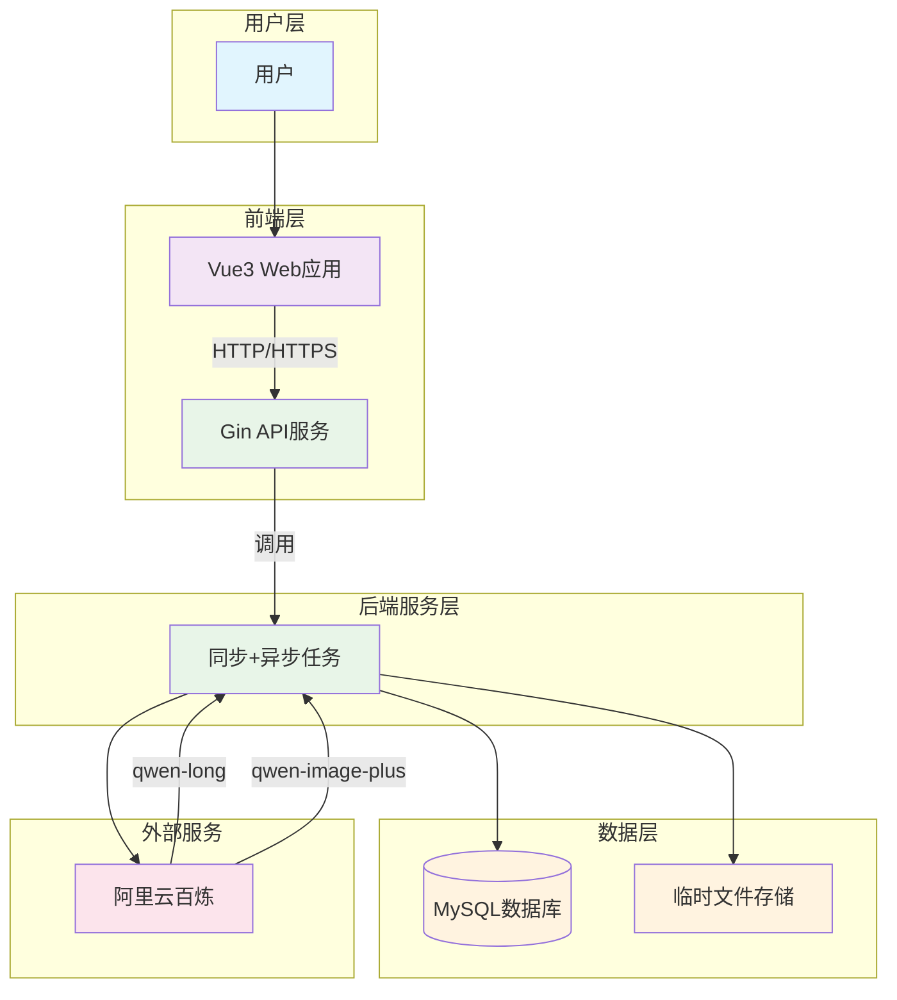
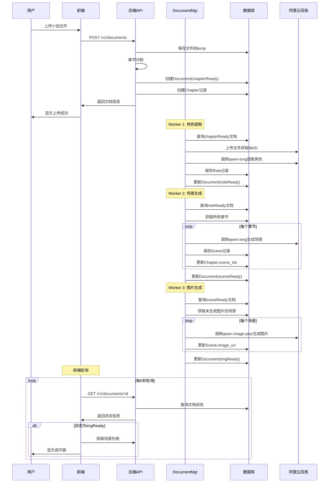
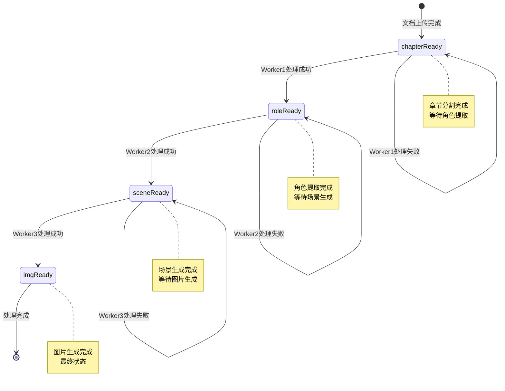
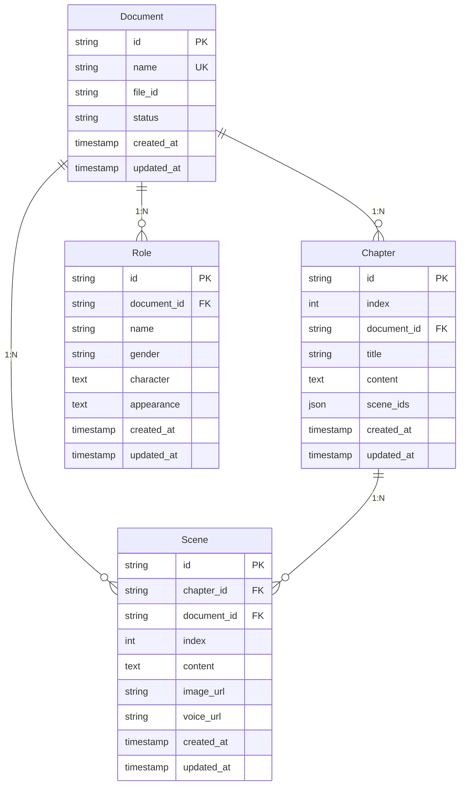
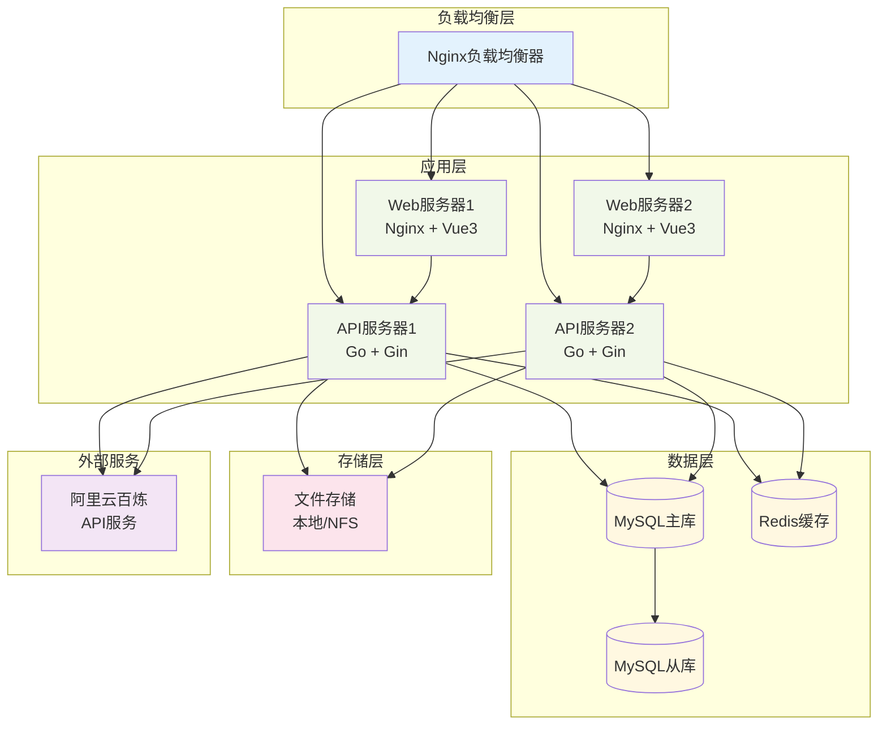

# 架构设计文档

---

## 第1页：项目概述

### 项目背景和目标

本项目是一个连环动漫智能体系统，将传统小说文本自动转换为可视化的连环漫画，提供沉浸式的阅读体验。

### 核心功能

1. **文档管理**：支持小说文件上传、章节分割、内容管理
2. **智能分析**：自动提取人物角色、性格特征、外貌描述
3. **场景生成**：将章节内容拆分为关键场景，生成适合画图的描述
4. **图片生成**：基于场景描述生成动漫风格的连环画
5. **内容展示**：提供直观的界面展示生成的连环画内容

### 技术栈总览

| 层级 | 技术选型 | 说明 |
|------|----------|------|
| 前端 | Vue 3 + TypeScript + Vite | 现代化前端框架 |
| 前端UI | Element Plus + SCSS | 组件库和样式系统 |
| 前端状态 | Pinia + Vue Router | 状态管理和路由 |
| 后端 | Go + Gin | 高性能后端服务 |
| 数据库 | MySQL 8.4 + GORM | 关系型数据库和ORM |
| AI服务 | 阿里云百炼 | LLM和图像生成服务 |
| 部署 | Docker + Nginx | 容器化部署 |

---

## 第2页：系统架构

### 整体架构图

### 架构分层说明

| 层级 | 职责 |
|------|------|
| **用户层** | 用户通过Web浏览器访问系统，进行文档上传、内容查看、状态监控 |
| **前端层** | Vue 3单页应用，提供响应式UI和实时状态更新 |
| **后端服务层** | RESTful API服务 + 异步任务管理，处理AI分析任务 |
| **数据层** | MySQL存储结构化数据，临时文件存储上传文件 |
| **外部服务层** | 阿里云百炼提供LLM和图像生成能力 |

### 模块间通信

- **前端 ↔ 后端**：HTTP/HTTPS RESTful API
- **后端 ↔ 数据库**：GORM ORM框架
- **后端内部**：Goroutine + Channel 异步处理
- **任务队列**：基于数据库状态的轮询机制

---

## 第3页：数据流转设计

### 完整业务流程图

### 状态机设计

### 异步任务处理

| Worker | 状态转换 | 主要任务 |
|--------|----------|----------|
| **Worker 1** | chapterReady → roleReady | 上传文件到阿里云，调用qwen-long提取角色信息 |
| **Worker 2** | roleReady → sceneReady | 为每个章节调用qwen-long生成场景描述 |
| **Worker 3** | sceneReady → imgReady | 为每个场景调用qwen-image-plus生成图片 |

---

## 第4页：数据库设计

### 数据库ER关系图

### 核心表说明

| 表名 | 说明 | 关键字段 |
|------|------|----------|
| **Document** | 文档主表 | id, name(唯一), file_id, status(状态机) |
| **Chapter** | 章节表 | id, document_id, index(序号), content, scene_ids |
| **Scene** | 场景表 | id, chapter_id, document_id, content, image_url |
| **Role** | 角色表 | id, document_id, name, gender, character, appearance |

### 关键索引

- `documents.status`：支持Worker轮询查询
- `chapters(document_id, index)`：章节序号唯一约束
- `scenes.document_id`：按文档查询场景
- `scenes.chapter_id`：按章节查询场景

---

## 第5页：部署架构

### 部署架构图

### 环境配置

| 环境 | 配置说明 |
|------|----------|
| **开发环境** | 单机部署，前端+后端+数据库，本地文件存储 |
| **测试环境** | 模拟生产配置，独立数据库，完整监控日志 |
| **生产环境** | 高可用部署，多实例+负载均衡，主从复制，Redis缓存 |

### 核心依赖

- **MySQL 8.4+**：数据持久化
- **阿里云百炼**：AI服务（qwen-long, qwen-image-plus）
- **Nginx**：反向代理和静态文件服务
- **Redis**（可选）：缓存和会话存储

---

## 第6页：团队分工

### 模块职责划分

| 模块 | 主要职责 | 技术要求 | 交付物 |
|------|----------|----------|--------|
| **前端开发** | Vue 3应用开发、UI实现、状态管理、API集成 | Vue 3 + TypeScript + Element Plus + Pinia | 前端应用代码、组件库、UI规范 |
| **后端开发** | Go服务开发、API设计、异步任务、数据库设计 | Go + Gin + GORM + MySQL | 后端服务代码、API文档、数据库脚本 |
| **数据库开发** | 数据库架构、表结构设计、索引优化、性能调优 | MySQL + SQL优化 + 索引设计 | 数据库设计文档、迁移脚本 |
| **测试** | 单元测试、集成测试、E2E测试、性能测试 | Go/Vue测试框架 + 自动化工具 | 测试用例、测试脚本、测试报告 |
| **运维** | 部署维护、监控告警、日志分析、安全备份 | Docker + Nginx + 监控系统 | 部署脚本、监控配置、运维文档 |

### 核心API接口

| 接口 | 方法 | 说明 |
|------|------|------|
| `/v1/documents` | POST | 创建文档（上传小说文件） |
| `/v1/documents` | GET | 获取文档列表 |
| `/v1/documents/:id` | GET | 获取文档详情 |
| `/v1/documents/:id/roles` | GET | 获取角色列表 |
| `/v1/documents/:id/scenes` | GET | 获取场景列表 |
| `/v1/documents/:id/chapters` | GET | 获取章节列表 |

### 开发规范要点

- **代码规范**：Go遵循Google Style Guide，前端使用ESLint + Prettier
- **API规范**：RESTful设计，统一响应格式 `{code, message, reqid, data}`
- **日志规范**：结构化日志（JSON），包含reqid追踪
- **错误处理**：分类处理（业务错误、系统错误、外部服务错误）

---

## 总结

### 关键特性

- ✅ 现代化技术栈：Vue 3 + Go + MySQL + 阿里云百炼
- ✅ 异步任务处理：三个Worker分阶段处理文档
- ✅ 状态机管理：清晰的文档状态流转机制
- ✅ 高可用部署：支持负载均衡和水平扩展
- ✅ 模块化设计：前后端分离，职责清晰

### 下一步行动

1. 按照模块分工组建开发团队
2. 搭建开发环境和CI/CD流程
3. 按照实施计划逐步开发各模块
4. 进行充分的测试和性能优化
5. 部署到生产环境并持续监控

